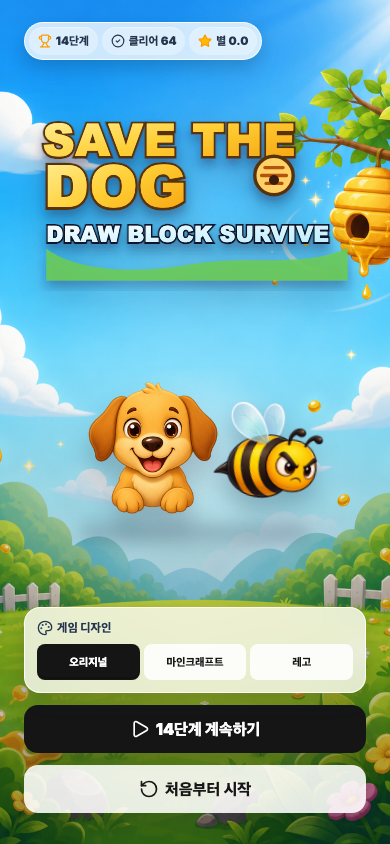
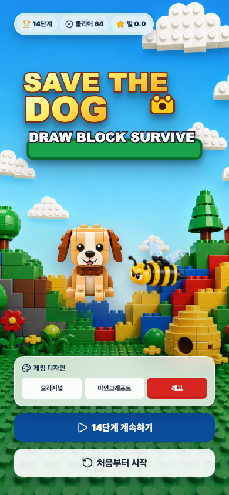
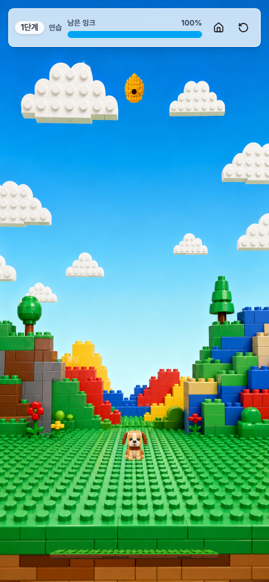

# Save The Dog

모바일 화면에서 선을 그려 강아지를 벌로부터 지키는 캐주얼 Svelte 게임입니다. 재미있는 `Save The Dog`류 퍼즐 게임 플레이를 참고해, SvelteKit과 Canvas만으로도 충분히 게임다운 경험을 만들 수 있다는 것을 보여주기 위해 만든 오픈소스 학습용 프로젝트입니다.

<p align="center">
  
  
  
</p>

## 프로젝트 소개

`Save The Dog`는 손가락이나 마우스로 방어선을 그린 뒤, 물리 엔진과 충돌 판정을 이용해 강아지가 제한 시간 동안 살아남도록 만드는 게임입니다. 이 저장소는 상업용 공식 게임이 아니라, 모바일 웹에서 Svelte로 게임을 만들고 구조화하는 방법을 보여주기 위한 교육용 예제입니다.

주요 목표는 간단합니다.

- SvelteKit으로 일반 웹앱뿐 아니라 Canvas 기반 게임도 만들 수 있음을 보여줍니다.
- Matter.js 물리 엔진, 게임 루프, 충돌 판정, 스테이지 데이터, 스킨 시스템을 작은 프로젝트 안에서 확인할 수 있게 구성했습니다.
- 오리지널, 마인크래프트, 레고 스타일 스킨을 바꿔가며 같은 게임 로직이 다른 비주얼로 동작하는 구조를 보여줍니다.
- 모바일 전용 플레이를 기준으로 만들었고, 데스크톱에서는 모바일 화면 비율을 확인하는 용도로 볼 수 있습니다.

## 주요 기능

- 강아지를 보호하기 위해 직접 선을 그리는 드로잉 플레이가 들어 있습니다.
- 벌, 벌집, 가시, 물·용암·산성 웅덩이, 폭탄, 얼음, 굴러오는 바위 같은 오브젝트가 물리 엔진 위에서 상호작용합니다.
- 스테이지를 클리어하면 진행도와 별 점수가 저장됩니다.
- 오리지널, 마인크래프트, 레고 스킨을 선택할 수 있고, 메인 배경과 게임 리소스가 스킨별로 바뀝니다.
- 스테이지 선택 지도, 이어하기, 처음부터 시작하기 흐름을 제공합니다.
- 모바일 화면에 맞춘 UI로 구성되어 심심풀이 플레이와 Svelte 게임 개발 학습에 적합합니다.

## 기술 구성

| 영역               | 사용 기술                                     |
| ------------------ | --------------------------------------------- |
| 앱 프레임워크      | `SvelteKit`, `Svelte 5`, `TypeScript`         |
| 게임 렌더링        | `Canvas 2D`, 커스텀 렌더러                    |
| 물리 엔진          | `matter-js`                                   |
| UI 스타일          | `Tailwind CSS v4`, `shadcn-svelte`, `bits-ui` |
| 아이콘             | `@lucide/svelte`                              |
| 테스트             | `Vitest`, `Playwright`, `svelte-check`        |
| 문서/컴포넌트 확인 | `Storybook`                                   |
| 배포 어댑터        | `@sveltejs/adapter-vercel`                    |

## 프로젝트 구조

```txt
src/lib/components/game/
  GameShell.svelte      # 모바일 게임 화면 프레임
  MainMenu.svelte       # 스킨 선택, 이어하기, 스테이지 선택
  GameCanvas.svelte     # Canvas 게임 화면
  GameHud.svelte        # 게임 중 HUD
  ResultOverlay.svelte  # 클리어/실패 결과 화면

src/lib/game/
  engine/               # 게임 루프, 렌더링, 물리, 벌 AI, 충돌 처리
  stages/               # 저작형 JSON 캠페인 맵과 반복 스테이지 생성 로직
  state/                # IndexedDB 기반 진행도, 결과, 설정, 사용자 맵 저장소
  skins.ts              # 스킨별 이미지와 드로잉 색상 정의

static/skins/
  classic/              # 오리지널 스타일 이미지
  minecraft/            # 마인크래프트 스타일 이미지
  lego/                 # 레고 스타일 이미지
```

## 실행 방법

```sh
pnpm install
pnpm run dev
```

개발 서버가 실행되면 브라우저에서 Vite가 안내하는 주소를 열면 됩니다. 보통 기본 주소는 `http://localhost:5173`이고, 이미 사용 중인 포트가 있으면 `5174`, `5175`처럼 다른 포트가 배정될 수 있습니다.

## 검증 명령

```sh
pnpm run check
pnpm run test:unit
pnpm run test:e2e
pnpm run build
```

`pnpm run check`는 Svelte/TypeScript 타입을 확인하고, `pnpm run test:unit`은 게임 로직 단위 테스트를 실행합니다. `pnpm run test:e2e`는 실제 브라우저에서 핵심 플레이 흐름을 검증하고, `pnpm run build`는 배포용 빌드를 확인합니다.

## Vercel 배포

이 프로젝트는 SvelteKit의 Vercel 어댑터를 사용합니다.

```js
// svelte.config.js
import adapter from "@sveltejs/adapter-vercel";
```

Vercel에 저장소를 연결한 뒤 기본 SvelteKit 설정으로 배포할 수 있습니다.

- Install Command: `pnpm install`
- Build Command: `pnpm run build`
- Framework Preset: `SvelteKit`

빌드 결과와 라우팅 처리는 `@sveltejs/adapter-vercel`이 담당합니다.

## 스킨과 이미지 수정

게임 이미지는 `static/skins/{skin}/` 아래에 있습니다. 새 스킨을 추가하려면 같은 구조로 이미지를 넣고 `src/lib/game/skins.ts`에 스킨 정의를 추가하면 됩니다.

캠페인 맵은 `src/lib/game/stages/stage-overrides.json`에서 관리합니다. 장애물 좌표·강아지 시작점·벌집 수·벌 수·잉크·환경·힌트를 단계 단위로 조정할 수 있습니다. 벌 AI 난이도는 맵과 분리된 `src/lib/game/stages/difficulty-overrides.json`에서 설정합니다. 각 단계는 `tutorial`, `shelter`, `hazard`, `swarm`, `physics`, `expert`, `master` 중 하나의 프로필을 고르고, 필요한 경우 속도·공격 후보·힘·AI 갱신 예산만 개별 덮어쓸 수 있습니다. 31단계 이후에는 같은 프로필 구조로 자동 확장됩니다.

진행도, 별점, 스킨/사운드 설정, 단계별 성공·실패 이력, 사용자 제작 맵 문서는 브라우저 `IndexedDB`의 `save-the-dog` 데이터베이스에 저장됩니다. 기존 `localStorage` 진행 데이터는 첫 실행에서 자동 이관됩니다.

메인 화면의 `지도 만들기`에서 강아지·벌집·발판·벽돌·나무·물·용암·가시·폭탄·바위·얼음의 위치와 크기를 직접 설정할 수 있습니다. 배경, 벌 난이도, 잉크, 생존 시간, 힌트도 같은 화면에서 지정한 뒤 `저장`, `시험`, `공유`를 사용할 수 있습니다. `내 지도`에서는 저장 맵을 편집·플레이·삭제하거나 공유 코드를 붙여넣어 불러옵니다. QR 코드는 앱 URL에 짧은 맵 문서를 담으며, 다른 사용자가 스캔해 페이지를 열면 자신의 IndexedDB에 자동 저장됩니다. 큰 맵이 QR 용량을 넘으면 같은 공유 코드를 복사해 전달할 수 있습니다.

필요한 기본 리소스는 다음과 같습니다.

- `background.png`
- `intro-background.png`
- `intro-title.svg`
- `dog.png`
- `dog-hurt.png`
- `bee.png`
- `hive.png`
- `ground.png`
- `platform.png`
- `spike.png`
- `background-forest.png`, `background-volcano.png`
- `acid.png`, `ice.png`, `stone.png`, `rolling-boulder.png`

## 오픈소스와 학습 목적

이 프로젝트는 모바일 웹 게임을 Svelte로 어떻게 구성할 수 있는지 보여주는 예제입니다. 게임 루프, Canvas 렌더링, 물리 엔진, 스테이지 데이터, 스킨 시스템, 브라우저 테스트를 한 번에 살펴볼 수 있도록 작게 구성했습니다.

공개 저장소로 운영하려면 프로젝트 목적에 맞는 `LICENSE` 파일을 추가하는 것을 권장합니다. 캐주얼 플레이와 교육 목적의 예제이므로, 코드를 수정해 다른 스킨, 스테이지, 난이도, UI를 실험해 보기 좋습니다.
